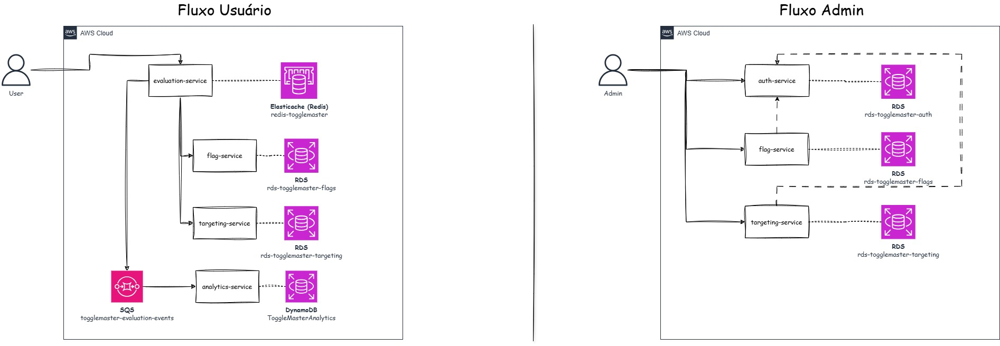
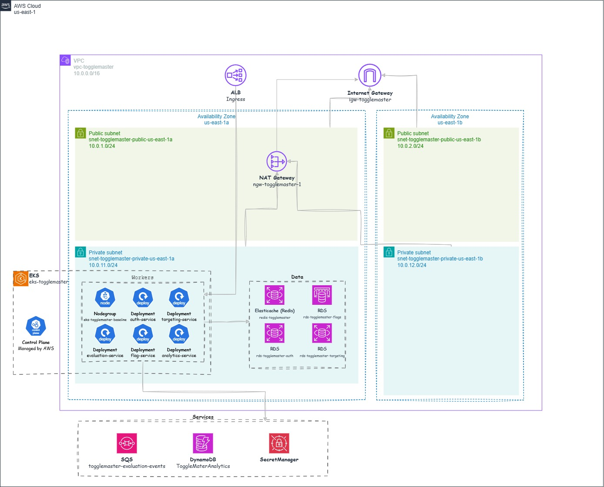

# ToggleMaster Platform

> Repositório central de artefatos compartilhados do **ToggleMaster** — uma plataforma de
> _feature flags_ construída como microsserviços para o Tech Challenge da **FIAP**.


---

## Sobre o desafio

O **ToggleMaster** é uma plataforma de **feature flags** (chaves de funcionalidade): permite
ligar e desligar recursos de uma aplicação em tempo de execução, direcionar funcionalidades para
públicos específicos e coletar métricas sobre cada avaliação — tudo sem novo deploy do código.

O projeto é a base do Tech Challenge da FIAP e foi propositalmente desenhado como um **ecossistema
de microsserviços** para exercitar, de ponta a ponta:

- **Containerização** de cada serviço e orquestração local com Docker Compose;
- **Padrão _database-per-service_** — cada microsserviço é dono do seu próprio schema/banco;
- **Comunicação síncrona** (HTTP entre serviços) e **assíncrona** (fila SQS → consumidor);
- **Deploy em Kubernetes (Amazon EKS)** com escalabilidade automática (HPA/KEDA), gestão de
  segredos (External Secrets + AWS Secrets Manager) e integração com recursos gerenciados da AWS
  (RDS, ElastiCache/Redis, SQS, DynamoDB).

Este repositório (`togglemaster-platform`) é o **ponto de entrada** do ecossistema: concentra o
`docker-compose.yml` que sobe todos os serviços em conjunto, os manifestos Kubernetes, a
Infraestrutura como Código (Terraform) e a documentação dos desafios enfrentados. O código-fonte
de cada microsserviço vive em um repositório irmão (`../auth-service`, `../flag-service`, etc.).

---

## Arquitetura

```
                                   ┌───────────────────┐
             cliente ──────────────►  evaluation-service │  (avalia uma flag para um usuário)
                                   │      :8004          │
                                   └─────────┬──────┬────┘
                                             │      │
                        valida a flag ◄──────┘      └──────► regras de targeting
                                │                                  │
                     ┌──────────▼─────────┐            ┌───────────▼────────┐
                     │    flag-service    │            │  targeting-service │
                     │       :8002        │            │        :8003       │
                     └──────────┬─────────┘            └───────────┬────────┘
                                │        valida a API key          │
                                └───────────────┬──────────────────┘
                                                ▼
                                     ┌────────────────────┐
                                     │    auth-service     │  (emite e valida API keys)
                                     │        :8001        │
                                     └────────────────────┘

     evaluation-service ──► publica evento na fila SQS ──► analytics-service ──► DynamoDB
                                                                 :8005        (persistência de métricas)
```

- **auth-service** é a raiz de confiança: emite e valida as _API keys_ que os demais serviços
  exigem nas chamadas.
- **evaluation-service** é o orquestrador do fluxo de leitura: recebe a requisição de avaliação,
  consulta a `flag-service` e a `targeting-service` e devolve o resultado (com cache em Redis).
- Cada avaliação também gera um **evento assíncrono** publicado em uma fila (SQS), consumido pela
  **analytics-service**, que persiste as métricas (DynamoDB na nuvem).

### Fluxo da aplicação

Diagrama do fluxo de avaliação de uma flag ponta a ponta:



### Arquitetura de infraestrutura (Fase 2 — AWS/EKS)

Visão da infraestrutura provisionada na nuvem:



---

## Serviços

| Serviço              | Porta | Stack | Banco / Estado         | Responsabilidade                                            |
|----------------------|-------|-------|------------------------|-------------------------------------------------------------|
| **auth-service**     | 8001  | Go    | PostgreSQL (`auth_db`) | Emissão e validação de API keys                             |
| **flag-service**     | 8002  | Go    | PostgreSQL (`flags_db`)| CRUD e leitura de feature flags                             |
| **targeting-service**| 8003  | Go    | PostgreSQL (`targeting_db`) | Regras de segmentação/direcionamento de flags          |
| **evaluation-service**| 8004 | —     | Redis (cache)          | Avalia uma flag para um usuário (orquestra flag + targeting)|
| **analytics-service**| 8005  | —     | SQS + DynamoDB (nuvem) | Consome eventos de avaliação e persiste métricas            |

Infraestrutura de apoio no ambiente local: **3 instâncias PostgreSQL** (uma por serviço, portas
`5432`/`5433`/`5434`) e um **Redis** (`6379`).

---

## Subindo o ambiente local

### Pré-requisitos

- **Docker Desktop** (ou Docker Engine + Docker Compose v2)
- Os repositórios dos microsserviços clonados **lado a lado** com este, pois o Compose constrói
  as imagens a partir dos diretórios irmãos (`../auth-service`, `../flag-service`, …):

  ```
  <workspace>/
  ├── togglemaster-platform/   ← você está aqui
  ├── auth-service/
  ├── flag-service/
  ├── targeting-service/
  ├── evaluation-service/
  └── analytics-service/
  ```

### 1. Configure as variáveis de ambiente (opcional)

```bash
cp .env.example .env
# Edite .env se quiser trocar senhas, portas ou integrações AWS (SQS/DynamoDB)
```

Os valores padrão do `.env.example` já funcionam para desenvolvimento local sem nenhuma alteração.
As variáveis de AWS (`AWS_SQS_URL`, `AWS_DYNAMODB_TABLE`, credenciais) são **opcionais** — deixe-as
em branco para rodar sem a integração de eventos/analytics.

### 2. Suba os serviços

Execute na raiz de `togglemaster-platform/`:

```bash
docker compose up --build
```

Isso irá:

1. Construir as imagens dos 5 microsserviços a partir dos diretórios irmãos;
2. Subir os bancos **PostgreSQL** e o **Redis**, aguardando o _healthcheck_ de cada um;
3. Executar o `db/init.sql` de cada serviço no primeiro boot (cria as tabelas automaticamente);
4. Subir os serviços na ordem correta de dependência (`auth-service` primeiro, depois os demais).

Para rodar em segundo plano:

```bash
docker compose up --build -d
```

Para acompanhar os logs (todos ou de um serviço):

```bash
docker compose logs -f
docker compose logs -f auth-service
```

Para parar e remover os contêineres:

```bash
docker compose down
```

Para parar e também remover os volumes (**apaga os dados dos bancos**):

```bash
docker compose down -v
```

---

## Testando os endpoints

### Health check

Cada serviço expõe um `/health`:

```bash
curl http://localhost:8001/health   # auth-service
curl http://localhost:8002/health   # flag-service
curl http://localhost:8003/health   # targeting-service
curl http://localhost:8004/health   # evaluation-service
curl http://localhost:8005/health   # analytics-service
```

Resposta esperada: `{"status":"ok"}`

### 1. Criar uma chave de API

```bash
curl -X POST http://localhost:8001/admin/keys \
  -H "Content-Type: application/json" \
  -H "Authorization: Bearer admin-secreto-123" \
  -d '{"name": "meu-primeiro-servico"}'
```

Resposta esperada:

```json
{
  "name": "meu-primeiro-servico",
  "key": "tm_key_...",
  "message": "Guarde esta chave com segurança! Você não poderá vê-la novamente."
}
```

> O token `admin-secreto-123` é o `MASTER_KEY` padrão do `.env.example` — **troque-o em produção**.

### 2. Validar a chave criada

Substitua `tm_key_...` pela chave retornada no passo anterior:

```bash
curl http://localhost:8001/validate \
  -H "Authorization: Bearer tm_key_..."
```

Resposta esperada: `{"message":"Chave válida"}`

Use essa chave nas chamadas aos demais serviços (flags, targeting e avaliação).

---

## Deploy na nuvem (Kubernetes / AWS)

O deploy em produção roda em **Amazon EKS**, integrado a recursos gerenciados da AWS. Os artefatos
correspondentes ficam em subpastas deste repositório:

| Pasta          | Conteúdo                                                                          |
|----------------|-----------------------------------------------------------------------------------|
| `k8s/`         | Manifestos Kubernetes (Deployments, Services, ExternalSecrets, HPA, KEDA, Ingress). Ver [`k8s/README.md`](k8s/README.md) para a ordem de apply. |
| `iac/`         | Infraestrutura como Código (Terraform) — provisiona EKS, RDS, Redis, SQS, DynamoDB. Ver [`iac/README.md`](iac/README.md). |
| `scripts/`     | Scripts de demonstração de escalabilidade (carga HTTP → HPA; carga de fila → KEDA). |
| `docs/desafios/` | Documentação dos desafios reais enfrentados no deploy e como foram resolvidos.  |

> **Leitura recomendada:** [`docs/desafios/02-deploy-kubernetes-aws.md`](docs/desafios/02-deploy-kubernetes-aws.md)
> registra as lições da migração do local para a nuvem — desde o teto de pods do Free Tier até a
> inicialização de schema no RDS e a gestão de segredos gerados em runtime.

---

## Estrutura do repositório

```
togglemaster-platform/
├── docker-compose.yml        # sobe todos os serviços + bancos + Redis (ambiente local)
├── .env.example              # variáveis de ambiente de referência
├── k8s/                      # manifestos Kubernetes (Amazon EKS)
├── iac/                      # Infraestrutura como Código (Terraform)
├── scripts/                  # scripts de demo de escalabilidade (HPA / KEDA)
├── docs/
│   └── desafios/             # documentação dos desafios de deploy
└── README.md                 # este arquivo
```

---

## Projeto acadêmico

Desenvolvido como parte do **Tech Challenge da FIAP**. O ambiente local via Docker Compose é a
entrega base; o deploy em Kubernetes/AWS demonstra a evolução do ecossistema para um cenário de
produção com escalabilidade, gestão de segredos e recursos gerenciados.
